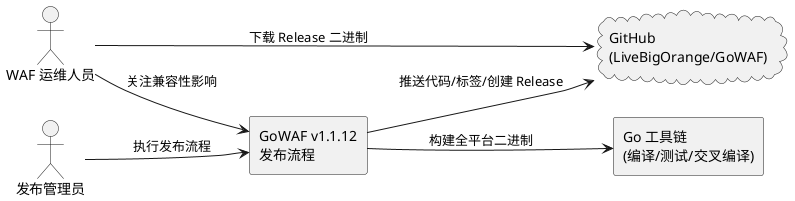
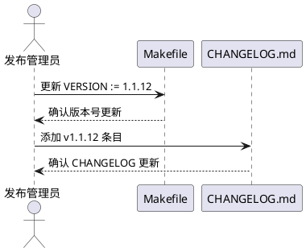
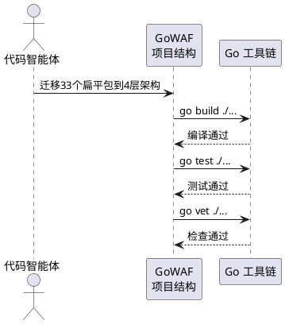
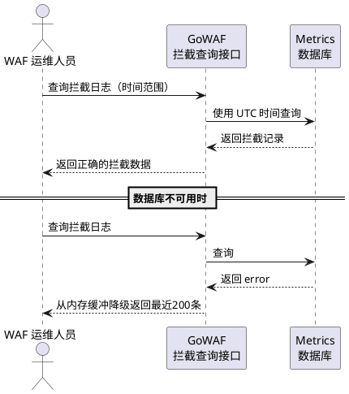
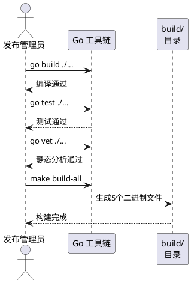
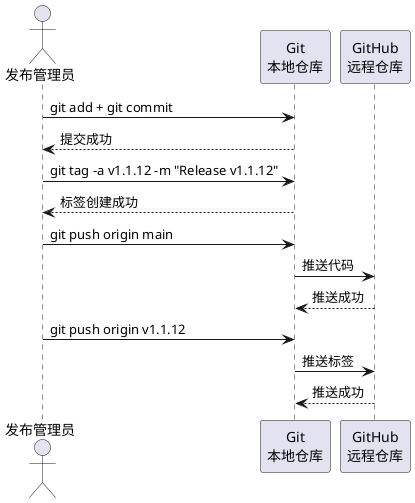
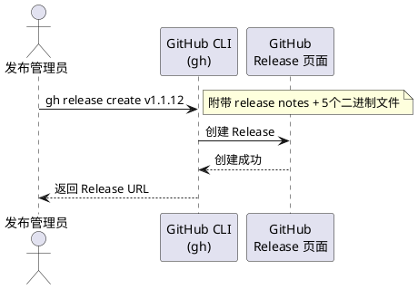
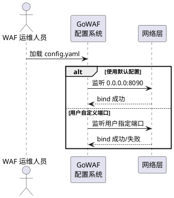

# GoWAF v1.1.12 版本发布需求规格

**版本**: v1.1.12  
**基于版本**: v1.1.11  
**发布日期**: 2026-05-17  
**文档状态**: 已完成  
**远程仓库**: https://github.com/LiveBigOrange/GoWAF.git

---

# 1. 组件定位

## 1.1 核心职责

本组件负责 GoWAF v1.1.12 版本的发布交付，涵盖项目结构重构、Bug修复、版本元数据更新、构建产物生成与 GitHub Release 发布。

## 1.2 核心输入

1. **v1.1.11 代码基线**：当前 Git 工作区中的 263 个文件变更（结构重构 + Bug修复，均已完成）
2. **修复日志**：`docs/fixlog_20260517.md` 中的 5 项 Bug 修复记录与重构说明
3. **版本号**：目标版本 v1.1.12
4. **构建环境**：Go 1.25.9 工具链，支持交叉编译

## 1.3 核心输出

1. **版本元数据更新**：Makefile VERSION 字段、CHANGELOG.md 条目
2. **Git 提交与标签**：v1.1.12 的 commit 和 annotated tag
3. **GitHub 推送**：代码和标签推送到远程仓库
4. **全平台二进制文件**：5 个构建产物（linux-amd64、linux-arm64、darwin-amd64、darwin-arm64、windows-amd64）
5. **GitHub Release**：v1.1.12 Release 页面，附带 release notes 和二进制附件

## 1.4 职责边界

- **不负责**：新功能开发、性能优化、安全策略变更
- **不负责**：API 接口变更或新增
- **不负责**：数据库 schema 迁移
- **不负责**：前端 UI/UX 改进
- **不负责**：CI/CD 流水线配置

---

# 2. 领域术语

**版本发布（Release）**
: 将特定版本的代码变更、Bug修复和重构成果打包为可交付物的过程，包括版本号更新、构建、标签创建和远程发布。

**项目结构重构（Structure Refactoring）**
: 将 `internal/` 下 33 个扁平包重组为 4 层架构（domain/infra/cert/pkg），消除反向依赖、合并碎片包、补充包文档的工程活动。

**依赖方向规则（Dependency Direction Rule）**
: 规定包间依赖方向的架构约束：domain→infra 允许，infra→domain 禁止，pkg→任何内部包禁止。

**EARS 格式（Easy Approach to Requirements Syntax）**
: 一种需求表述规范，使用条件+主体+响应的结构化模式描述需求验收条件。

**Annotated Tag**
: Git 标签的一种，携带创建者、日期和附注信息，用于标记正式发布版本。

**交叉编译（Cross Compilation）**
: 在单一平台上为目标操作系统和架构生成可执行文件的构建过程。

**Release Notes**
: 版本发布说明文档，包含变更摘要、修复列表、已知问题和升级指南。

**UTC 时间一致性（UTC Time Consistency）**
: 数据写入和查询使用相同时区（UTC）的时间处理策略，避免时区偏移导致数据不可见。

---

# 3. 角色与边界

## 3.1 核心角色

- **发布管理员**：执行版本发布流程，包括版本号更新、构建、标签创建、推送和 Release 发布
- **WAF 运维人员**：部署新版本，关注 Bug 修复和端口变更的兼容性影响

## 3.2 外部系统

- **GitHub（github.com）**：代码托管、标签管理、Release 发布平台
- **Go 工具链**：编译构建、测试执行、交叉编译工具

## 3.3 交互上下文

---

# 4. DFX约束

## 4.1 性能

- 构建全平台 5 个二进制文件的总时间不得超过 5 分钟
- 所有构建产物必须通过 `go build ./...` 编译检查，零编译错误

## 4.2 可靠性

- 所有构建产物必须通过 `go test ./...` 测试，零测试失败
- 所有构建产物必须通过 `go vet ./...` 检查，零警告
- 版本标签 v1.1.12 必须为 annotated tag，包含版本号和发布日期

## 4.3 安全性

- 构建产物中禁止包含硬编码密钥或凭证
- Release 附件必须为构建产物的原文件，禁止篡改或重新打包

## 4.4 可维护性

- CHANGELOG.md 必须遵循 [Keep a Changelog](https://keepachangelog.com/zh-CN/1.0.0/) 格式
- 版本号必须遵循 [语义化版本](https://semver.org/lang/zh-CN/) 规范
- 依赖方向规则必须持续有效：infra→domain 禁止，pkg→任何内部包禁止

## 4.5 兼容性

- 管理界面端口从 9090 变更为 8090，运维人员必须更新相关防火墙规则和反向代理配置
- `config.yaml` 中 `listen` 字段的默认值变更为 `0.0.0.0:8090`
- API 接口无 breaking change，前后端兼容

---

# 5. 核心能力

## 5.1 版本元数据更新

### 5.1.1 业务规则

1. **Makefile 版本号更新规则**：When 发布管理员执行版本元数据更新操作，the GoWAF 构建系统 shall 将 Makefile 中 `VERSION` 字段从 `1.1.11` 更新为 `1.1.12`
   - 验收条件：[执行 `grep "VERSION" Makefile`] → [输出包含 `VERSION := 1.1.12`]

2. **CHANGELOG 条目新增规则**：When Makefile 版本号更新完成，the GoWAF 发布流程 shall 在 CHANGELOG.md 中添加 `[1.1.12] - 2026-05-17` 条目
   - 验收条件：[打开 CHANGELOG.md] → [包含 `## [1.1.12] - 2026-05-17` 标题]

3. **CHANGELOG 内容规则**：When CHANGELOG 条目创建完成，the 发布流程 shall 按 Keep a Changelog 格式组织变更内容，包含"重构"和"修复"两个分类
   - 验收条件：[查看 v1.1.12 条目] → [包含 `### 重构` 和 `### 修复` 子标题]

4. **CHANGELOG Unreleased 清理规则**：When v1.1.12 条目添加完成，the 发布流程 shall 将 CHANGELOG.md 中 `[Unreleased]` 区段清空
   - 验收条件：[查看 `[Unreleased]` 区段] → [该区段下无条目]

### 5.1.2 交互流程

### 5.1.3 异常场景

1. **Makefile VERSION 字段未找到**
   - 触发条件：Makefile 中不存在 `VERSION :=` 行
   - 系统行为：发布流程中止，报告错误信息
   - 用户感知：错误提示"Makefile 中未找到 VERSION 字段定义"

2. **CHANGELOG.md 已存在 v1.1.12 条目**
   - 触发条件：CHANGELOG.md 中已包含 `## [1.1.12]` 行
   - 系统行为：发布流程中止，报告重复条目
   - 用户感知：错误提示"CHANGELOG.md 已包含 v1.1.12 条目，请检查是否重复发布"

---

## 5.2 项目结构重构交付

### 5.2.1 业务规则

1. **4层架构规则**：The GoWAF 项目结构 shall 将 `internal/` 下所有业务包组织为 4 层架构：`domain/`（业务领域层）、`infra/`（基础设施层）、`cert/`（证书与更新域）、`pkg/`（通用工具域）
   - 验收条件：[检查 `internal/` 目录结构] → [包含 domain/、infra/、cert/、pkg/ 四个子目录]

2. **业务领域层分组规则**：The GoWAF 业务领域层 shall 包含 5 个子域：`proxy/`（核心代理域）、`security/`（安全检测域）、`gateway/`（Web接口域）、`auxiliary/`（辅助功能域）、`proxyconfig/`（代理配置管理）
   - 验收条件：[检查 `internal/domain/` 目录] → [包含 proxy/、security/、gateway/、auxiliary/、proxyconfig/ 五个子目录]

3. **基础设施层分组规则**：The GoWAF 基础设施层 shall 包含配置管理、数据存储、日志、事件、通知等基础设施组件
   - 验收条件：[检查 `internal/infra/` 目录] → [包含 config/、storage/、logger/、event/、notify/ 子目录及 interfaces.go]

4. **依赖方向规则-domain→infra**：While GoWAF 使用 4 层架构，the GoWAF 项目 shall 允许 `domain/` 下的包依赖 `infra/` 下的包
   - 验收条件：[运行依赖方向检查] → [domain→infra 依赖无违规]

5. **依赖方向规则-infra→domain禁止**：While GoWAF 使用 4 层架构，the GoWAF 项目 shall 禁止 `infra/` 下的包依赖 `domain/` 下的包
   - 验收条件：[运行依赖方向检查] → [infra→domain 依赖零违规]

6. **依赖方向规则-pkg零外部依赖**：While GoWAF 使用 4 层架构，the GoWAF 项目 shall 禁止 `pkg/` 下的包依赖任何 `internal/` 下的包
   - 验收条件：[运行依赖方向检查] → [pkg→internal 依赖零违规]

7. **包文档完整性规则**：The GoWAF 项目 shall 为每个 internal/ 下的 Go 包提供 `doc.go` 文件
   - 验收条件：[遍历 internal/ 下所有 Go 包] → [每个包目录均包含 doc.go 文件]

8. **包声明一致性规则**：The GoWAF 项目 shall 确保每个 Go 文件的 `package` 声明与所在目录名一致
   - 验收条件：[运行 `go build ./...`] → [零编译错误，无包声明不一致]

### 5.2.2 交互流程

### 5.2.3 异常场景

1. **依赖方向违规**
   - 触发条件：重构后存在 infra→domain 或 pkg→internal 的依赖
   - 系统行为：构建流程报告具体违规包和依赖路径
   - 用户感知：错误提示列出所有违规的依赖路径

2. **包迁移遗漏**
   - 触发条件：旧路径下仍有 Go 源文件残留
   - 系统行为：构建流程报告旧路径残留文件
   - 用户感知：警告提示"旧路径存在残留文件，请清理"

---

## 5.3 Bug修复交付

### 5.3.1 业务规则

1. **拦截日志时区一致性规则**：When GoWAF 查询拦截日志数据，the GoWAF 仪表盘查询接口 shall 使用 UTC 时间构造查询时间窗口，与拦截事件写入时区一致
   - 验收条件：[在 UTC+8 时区下查询最近7天的拦截日志] → [返回正确的拦截记录，数据与写入一致]

2. **logDB 日志注入规则**：When GoWAF 启动并创建 logDB 实例，the GoWAF 初始化流程 shall 在 logDB 创建后调用 `logger.SetDB()` 将 logDB 注入日志系统
   - 验收条件：[启动 GoWAF 后产生日志事件] → [日志数据写入 logdb 数据库，可通过 API 查询到]

3. **拦截日志降级条件规则**：When GoWAF 查询拦截日志且 metrics 数据库返回0条记录，the GoWAF 拦截查询接口 shall 返回空分页结果而非降级到内存缓冲
   - 验收条件：[数据库有0条拦截记录时查询] → [返回空数组，不降级到内存缓冲]

4. **拦截日志降级触发规则**：If metrics 数据库查询返回 error，the GoWAF 拦截查询接口 shall 降级到内存环形缓冲获取数据
   - 验收条件：[数据库查询返回 error] → [从内存环形缓冲获取最近200条记录]

5. **pageSize 上限调整规则**：The GoWAF 拦截查询接口 shall 将 pageSize 参数上限设置为 10000
   - 验收条件：[请求 page_size=10000] → [返回最多10000条记录，不重置为100]

6. **管理界面端口变更规则**：Where GoWAF 运行在 Windows 系统上，the GoWAF 默认配置 shall 使用端口 8090 作为管理界面监听端口
   - 验收条件：[在 Windows 上使用默认配置启动 GoWAF] → [管理界面在 8090 端口监听，不与 Hyper-V 保留端口冲突]

### 5.3.2 交互流程

### 5.3.3 异常场景

1. **时区偏移导致数据不可见**
   - 触发条件：查询使用本地时间而写入使用 UTC 时间，时区偏移导致查询窗口与数据不重叠
   - 系统行为：查询返回空结果
   - 用户感知：拦截日志页面显示"暂无数据"，仪表盘统计为空
   - **已修复**：v1.1.12 中所有查询均使用 UTC 时间

2. **logDB 为 nil 时日志丢失**
   - 触发条件：logger 初始化时 logDB 参数为 nil
   - 系统行为：日志仅写入文件，不写入数据库
   - 用户感知：日志查询 API 返回空数据
   - **已修复**：v1.1.12 中添加 `logger.SetDB()` 延迟注入

3. **降级逻辑误触发**
   - 触发条件：查询成功但返回0条记录时错误降级到内存缓冲
   - 系统行为：返回内存缓冲数据而非空结果
   - 用户感知：显示过期的内存缓冲数据而非空页
   - **已修复**：v1.1.12 中仅当查询返回 error 时降级

4. **端口被 Hyper-V 保留**
   - 触发条件：Windows 上 Hyper-V 保留端口范围包含 9090
   - 系统行为：`bind()` 被拒绝，服务启动失败
   - 用户感知：GoWAF 启动报错"address already in use"
   - **已修复**：v1.1.12 中默认端口改为 8090

---

## 5.4 构建与验证

### 5.4.1 业务规则

1. **编译验证规则**：When GoWAF v1.1.12 代码变更提交前，the Go 工具链 shall 通过 `go build ./...` 编译检查
   - 验收条件：[执行 `go build ./...`] → [返回成功，零编译错误]

2. **测试验证规则**：When GoWAF v1.1.12 代码变更提交前，the Go 工具链 shall 通过 `go test ./...` 全量测试
   - 验收条件：[执行 `go test ./...`] → [返回成功，零测试失败]

3. **静态分析验证规则**：When GoWAF v1.1.12 代码变更提交前，the Go 工具链 shall 通过 `go vet ./...` 静态分析
   - 验收条件：[执行 `go vet ./...`] → [返回成功，零警告]

4. **交叉编译规则**：When 发布管理员执行全平台构建，the Go 构建系统 shall 生成以下5个二进制文件
   - `gowaf-linux-amd64`：Linux AMD64
   - `gowaf-linux-arm64`：Linux ARM64
   - `gowaf-darwin-amd64`：macOS AMD64
   - `gowaf-darwin-arm64`：macOS ARM64
   - `gowaf-windows-amd64.exe`：Windows AMD64
   - 验收条件：[执行 `make build-all`] → [build/ 目录包含上述5个文件]

5. **构建产物路径规则**：The GoWAF 构建系统 shall 将所有构建产物输出到 `build/` 目录
   - 验收条件：[构建完成后] → [build/ 目录存在且包含目标二进制文件]

### 5.4.2 交互流程

### 5.4.3 异常场景

1. **编译失败**
   - 触发条件：代码存在语法错误或类型不匹配
   - 系统行为：`go build` 返回非零退出码和错误信息
   - 用户感知：构建中止，显示编译错误详情

2. **测试失败**
   - 触发条件：单元测试断言不通过
   - 系统行为：`go test` 返回非零退出码和失败测试名
   - 用户感知：构建中止，显示失败测试详情

3. **交叉编译失败**
   - 触发条件：特定平台的 CGO 依赖或系统调用不兼容
   - 系统行为：对应平台构建失败
   - 用户感知：build/ 目录缺少对应平台的二进制文件

---

## 5.5 Git 提交与标签

### 5.5.1 业务规则

1. **提交范围规则**：When 发布管理员执行版本提交，the Git 版本控制系统 shall 将当前工作区所有变更文件（包含重构和Bug修复）提交到版本历史
   - 验收条件：[执行 `git status`] → [工作区干净，无未提交变更]

2. **提交消息规则**：When 发布管理员创建 v1.1.12 提交，the Git 版本控制系统 shall 使用 Conventional Commits 格式的提交消息
   - 验收条件：[执行 `git log -1`] → [提交消息以 `feat`、`fix` 或 `refactor` 等类型前缀开头]

3. **Annotated Tag 规则**：When 发布管理员创建版本标签，the Git 版本控制系统 shall 创建 annotated tag `v1.1.12`，附注包含版本号和发布日期
   - 验收条件：[执行 `git tag -l v1.1.12`] → [标签存在且为 annotated tag]

4. **远程推送规则**：When 本地提交和标签创建完成，the Git 版本控制系统 shall 将代码和标签推送到远程仓库 `https://github.com/LiveBigOrange/GoWAF.git`
   - 验收条件：[在 GitHub 上查看] → [v1.1.12 标签和对应提交存在]

### 5.5.2 交互流程

### 5.5.3 异常场景

1. **推送被拒绝**
   - 触发条件：远程分支有更新，本地落后于远程
   - 系统行为：`git push` 返回非零退出码
   - 用户感知：错误提示"Updates were rejected"，需先 pull 再 push

2. **标签已存在**
   - 触发条件：本地或远程已存在 `v1.1.12` 标签
   - 系统行为：`git tag` 返回错误
   - 用户感知：错误提示"tag 'v1.1.12' already exists"

---

## 5.6 GitHub Release 发布

### 5.6.1 业务规则

1. **Release 创建规则**：When v1.1.12 标签推送到 GitHub，the 发布流程 shall 使用 `gh release create` 创建 GitHub Release，标题为 `v1.1.12`
   - 验收条件：[在 GitHub 上查看 Releases] → [存在标题为 `v1.1.12` 的 Release]

2. **Release Notes 内容规则**：When GitHub Release 创建完成，the Release Notes shall 包含以下内容
   - 版本号和发布日期
   - 项目结构重构摘要（4层架构、依赖方向规则）
   - Bug 修复列表（5项修复，标注严重程度）
   - 验证结果确认（构建/测试/vet/依赖方向均通过）
   - 验收条件：[查看 v1.1.12 Release Notes] → [包含上述所有内容分类]

3. **二进制附件规则**：When GitHub Release 创建完成，the Release 页面 shall 附加5个全平台构建产物作为下载附件
   - 验收条件：[查看 v1.1.12 Release Assets] → [包含 gowaf-linux-amd64、gowaf-linux-arm64、gowaf-darwin-amd64、gowaf-darwin-arm64、gowaf-windows-amd64.exe]

4. **Release 标签关联规则**：When GitHub Release 创建完成，the Release shall 关联到 `v1.1.12` Git 标签
   - 验收条件：[查看 Release 详情] → [Target tag 为 v1.1.12]

### 5.6.2 交互流程

### 5.6.3 异常场景

1. **gh CLI 未安装**
   - 触发条件：系统未安装 GitHub CLI (`gh`)
   - 系统行为：发布流程中止
   - 用户感知：错误提示"gh command not found"，建议安装 GitHub CLI

2. **gh 认证失败**
   - 触发条件：`gh auth status` 未通过
   - 系统行为：发布流程中止
   - 用户感知：错误提示"not logged into any GitHub hosts"，需先执行 `gh auth login`

3. **Release 已存在**
   - 触发条件：GitHub 上已存在 `v1.1.12` Release
   - 系统行为：`gh release create` 返回错误
   - 用户感知：错误提示"release already exists"

4. **二进制文件上传失败**
   - 触发条件：网络问题或文件过大导致上传超时
   - 系统行为：Release 创建但缺少部分附件
   - 用户感知：Release 页面缺少部分二进制文件下载

---

## 5.7 端口变更兼容性

### 5.7.1 业务规则

1. **默认端口变更规则**：Where GoWAF 使用默认配置启动，the GoWAF 配置系统 shall 将管理界面默认监听端口从 9090 变更为 8090
   - 验收条件：[使用默认 `config.yaml` 启动 GoWAF] → [管理界面在 `0.0.0.0:8090` 监听]

2. **端口冲突避免规则**：Where GoWAF 运行在 Windows 系统，the GoWAF 默认端口 shall 避开 Hyper-V 保留端口范围（9085-9184）
   - 验收条件：[在 Windows 上使用默认配置启动] → [端口 8090 不在 9085-9184 范围内，bind() 成功]

3. **自定义端口保留规则**：While 用户在 `config.yaml` 中显式配置了管理界面端口，the GoWAF 配置系统 shall 使用用户自定义端口而非默认端口
   - 验收条件：[config.yaml 设置 `listen: "0.0.0.0:3000"`] → [管理界面在 3000 端口监听]

### 5.7.2 交互流程

### 5.7.3 异常场景

1. **升级后端口不匹配**
   - 触发条件：从 v1.1.11 升级到 v1.1.12，前端反向代理或防火墙规则仍指向 9090
   - 系统行为：GoWAF 在 8090 监听，9090 无服务
   - 用户感知：管理界面无法通过旧端口访问，需更新代理/防火墙配置指向 8090

2. **8090 端口被占用**
   - 触发条件：8090 端口已被其他进程占用
   - 系统行为：`bind()` 被拒绝，GoWAF 启动失败
   - 用户感知：错误提示"address already in use"，需在 `config.yaml` 中配置其他端口

---

# 6. 数据约束

## 6.1 版本号

1. **version**：格式为 `MAJOR.MINOR.PATCH`，当前值 `1.1.12`，必须遵循语义化版本规范
2. **previous_version**：值为 `1.1.11`，用于版本对比和升级检测

## 6.2 构建产物

1. **product_name**：前缀为 `gowaf-`，后接平台和架构标识
2. **platform**：取值范围为 `{linux, darwin, windows}`
3. **architecture**：取值范围为 `{amd64, arm64}`
4. **extension**：Windows 平台为 `.exe`，其他平台为空
5. **output_path**：所有产物必须位于 `build/` 目录下

## 6.3 修复记录

1. **severity**：取值范围为 `{严重, 中等, 低}`，表示 Bug 影响程度
2. **bug_id**：格式为递增整数，从 1 开始
3. **affected_components**：标识受影响的组件或模块名
4. **fix_verification**：取值为 `{已验证, 未验证}`，v1.1.12 中所有修复必须为"已验证"

## 6.4 依赖方向

1. **source_layer**：取值范围为 `{domain, infra, cert, pkg, apischema, backend, testutil}`
2. **target_layer**：取值同 source_layer
3. **allowed**：domain→infra 允许；infra→domain 禁止；pkg→任何内部包 禁止

---

# 7. 验收检查清单

| # | 检查项 | 验收条件 | EARS 模式 |
|---|--------|----------|-----------|
| 1 | Makefile 版本号 | `VERSION := 1.1.12` | Ubiquitous |
| 2 | CHANGELOG 条目 | 包含 `## [1.1.12] - 2026-05-17` | Event-Driven |
| 3 | go build | 零编译错误 | Ubiquitous |
| 4 | go test | 零测试失败 | Ubiquitous |
| 5 | go vet | 零警告 | Ubiquitous |
| 6 | 依赖方向检查 | infra→domain 零违规, pkg→internal 零违规 | State-Driven |
| 7 | 包文档完整性 | 所有 internal/ 包包含 doc.go | Ubiquitous |
| 8 | 包声明一致性 | package 声明与目录名一致 | Ubiquitous |
| 9 | 全平台构建 | build/ 包含5个二进制文件 | Event-Driven |
| 10 | Git 提交 | 工作区干净 | Event-Driven |
| 11 | v1.1.12 标签 | annotated tag 存在 | Event-Driven |
| 12 | GitHub 推送 | 代码和标签在远程存在 | Event-Driven |
| 13 | GitHub Release | v1.1.12 Release 存在 | Event-Driven |
| 14 | Release 附件 | 5个二进制文件已附加 | Event-Driven |
| 15 | 时区一致性修复 | UTC+8 下拦截日志正确显示 | Event-Driven |
| 16 | logDB 注入修复 | 日志 API 返回非空数据 | Event-Driven |
| 17 | 降级逻辑修复 | 0条记录时返回空而非降级 | State-Driven |
| 18 | pageSize 上限 | page_size=10000 返回正确 | Ubiquitous |
| 19 | 端口变更 | 默认端口为 8090 | Optional Feature |
| 20 | 旧路径残留 | internal/ 旧目录无残留 | Ubiquitous |

---

# 8. 发布流程步骤

| 步骤 | 操作 | 命令/动作 | 前置条件 |
|------|------|-----------|----------|
| 1 | 更新 Makefile VERSION | `VERSION := 1.1.12` | 代码变更已完成 |
| 2 | 更新 CHANGELOG.md | 添加 v1.1.12 条目 | Makefile 已更新 |
| 3 | Git 提交所有变更 | `git add . && git commit` | 步骤1-2完成 |
| 4 | 创建 v1.1.12 tag | `git tag -a v1.1.12 -m "Release v1.1.12"` | 步骤3完成 |
| 5 | 推送到 GitHub | `git push origin main && git push origin v1.1.12` | 步骤4完成 |
| 6 | 全平台构建 | `make build-all` | 步骤5完成 |
| 7 | 创建 GitHub Release | `gh release create v1.1.12 ... --files build/*` | 步骤6完成 |
